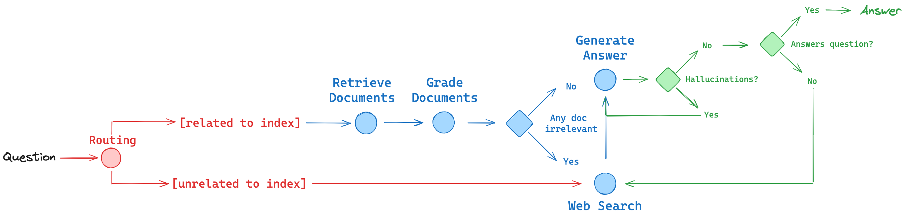

# Advanced RAG
 
This is my take on Mistral's and LangChain RAG cookbooks with some modifications of mine.
I do not claim ownership of all the code.

I used Arxive API to extract the pdf's of some LLM related topis such as the RAG papers these repo addresses as well as: 
* Attention is all you need [paper](https://arxiv.org/pdf/2401.15884.pdf)
* Flash Attention: Fast and Memory-Efficient Exact Attention with IO-Awareness [paper](https://arxiv.org/abs/2205.14135)
* Language Models are Few-Shot Learners [paper](https://arxiv.org/abs/2005.14165)

### RAG

We'll apply LangGraph to build RAG agents that use ideas from 3 papers:

* Corrective-RAG (CRAG) [paper](https://arxiv.org/pdf/2401.15884.pdf) uses self-grading on retrieved documents and web-search fallback if documents are not relevant.
* Self-RAG [paper](https://arxiv.org/abs/2310.11511) adds self-grading on generations for hallucinations and for ability to answer the question.
* Adaptive RAG [paper](https://arxiv.org/abs/2403.14403) routes queries between different RAG approaches based on their complexity.

We implement each approach as a control flow in LangGraph:
- **Planning:** The sequence of RAG steps (e.g., retrieval, grading, generation) that we want the agent to take
- **Memory:** All the RAG-related information (input question, retrieved documents, etc) that we want to pass between steps
- **Tool use:** All the tools needed for RAG (e.g., decide web search or vectorstore retrieval based on the question)

In the 3 notebooks, we will build from CRAG (blue, below) to Self-RAG (green) and finally to Adaptive RAG (red):

[original repo](https://github.com/mistralai/cookbook/tree/main/third_party/langchain)